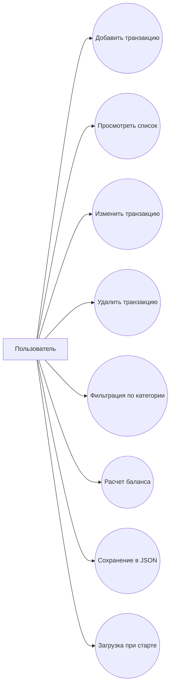
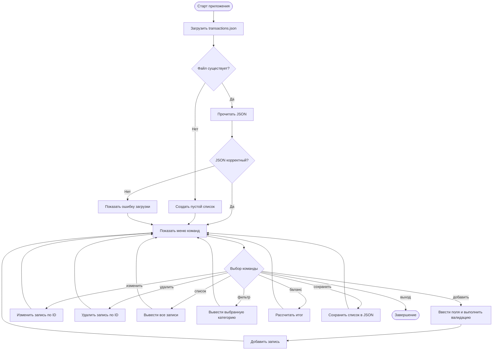
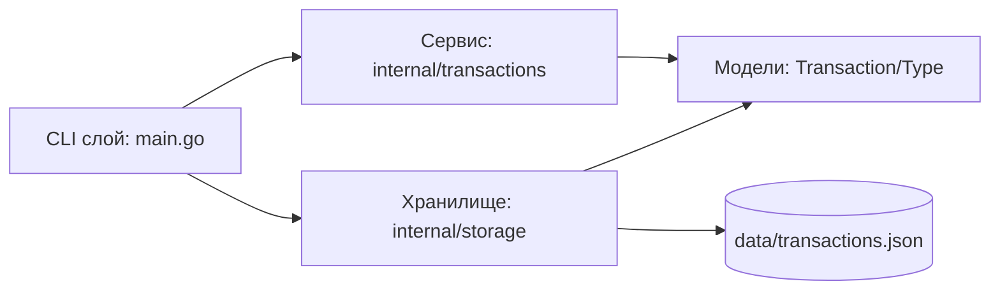
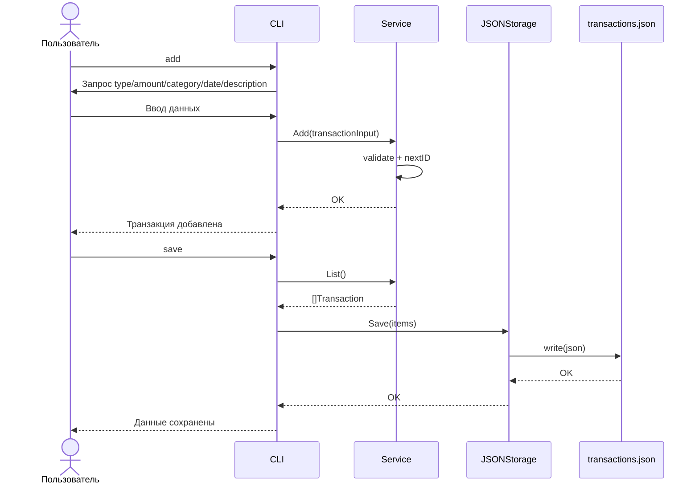

# 03. UML/BPMN-диаграммы проекта

В документе собраны диаграммы в формате `mermaid`, описывающие поведение и структуру `finance_tracker`.

## 1) Use Case (варианты использования)

## 2) Activity/BPMN (процесс выполнения команды)

## 3) Component (компонентная диаграмма)

## 4) Sequence (последовательность: add + save)

